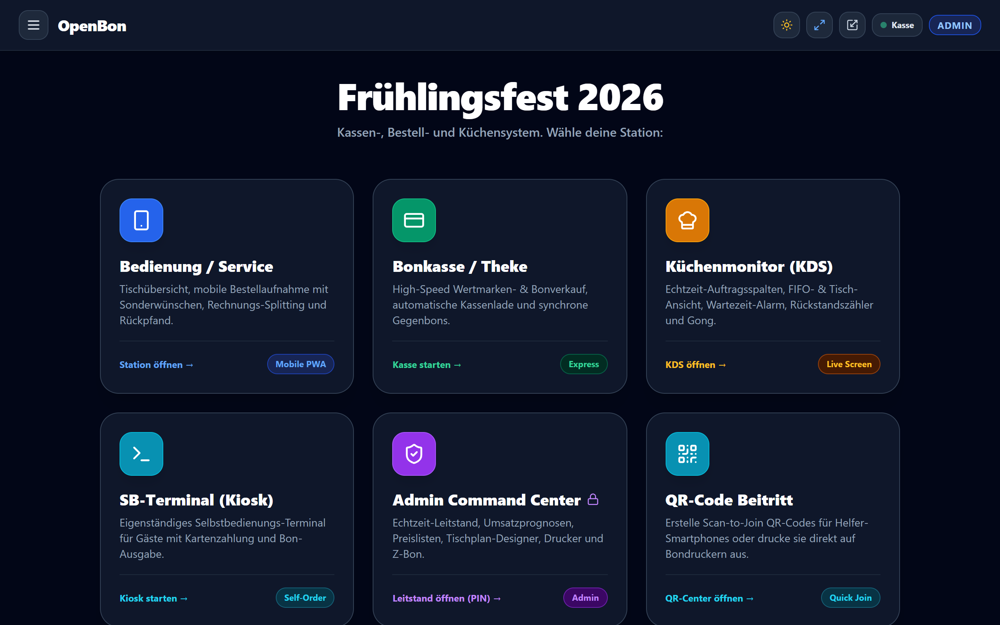
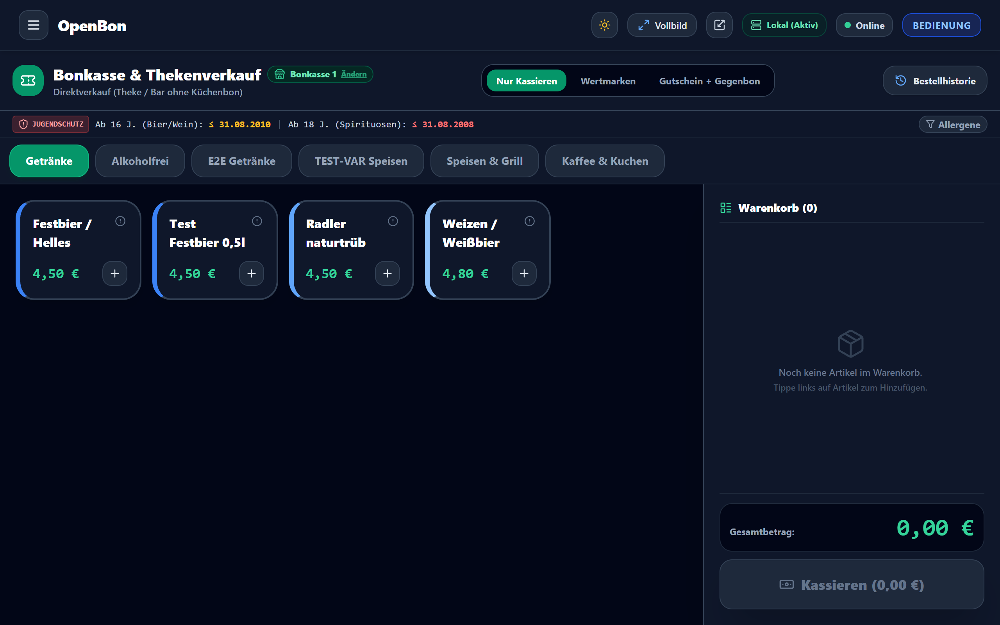
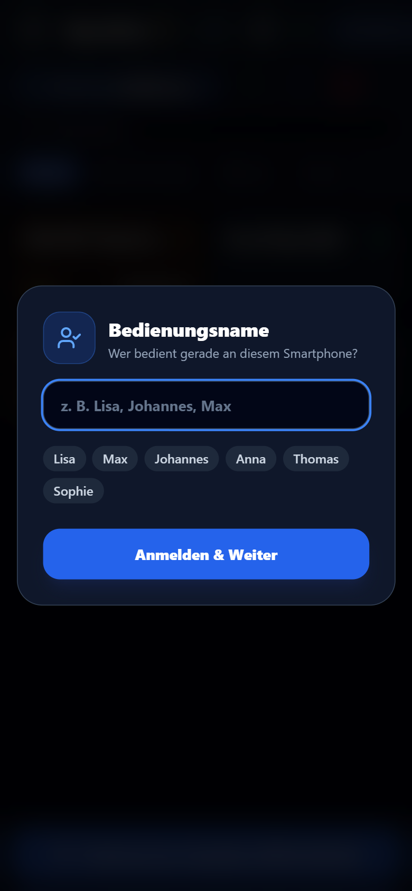
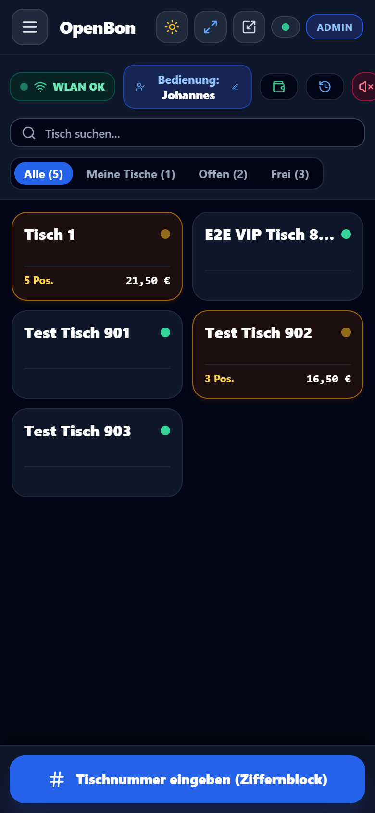
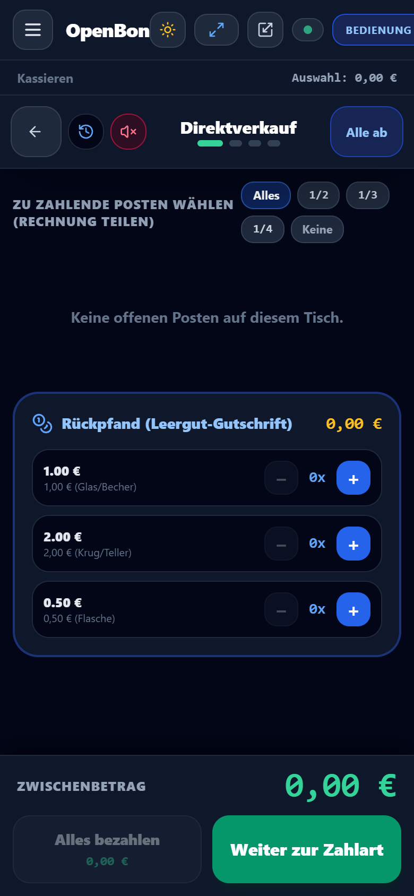
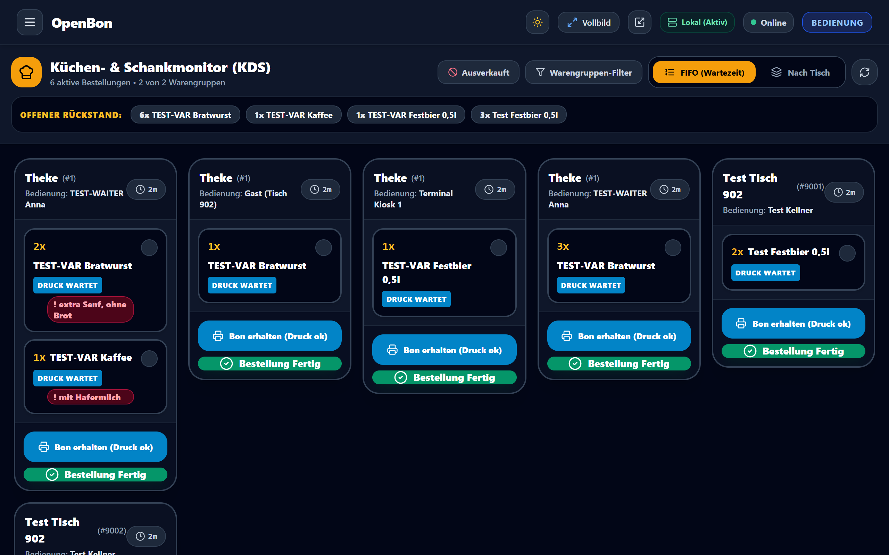
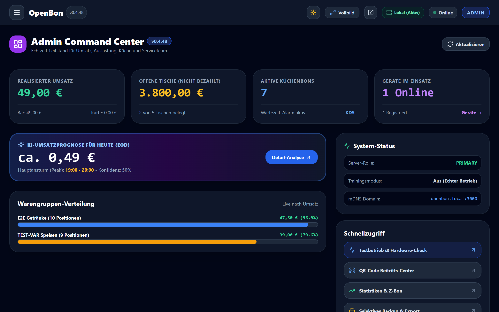
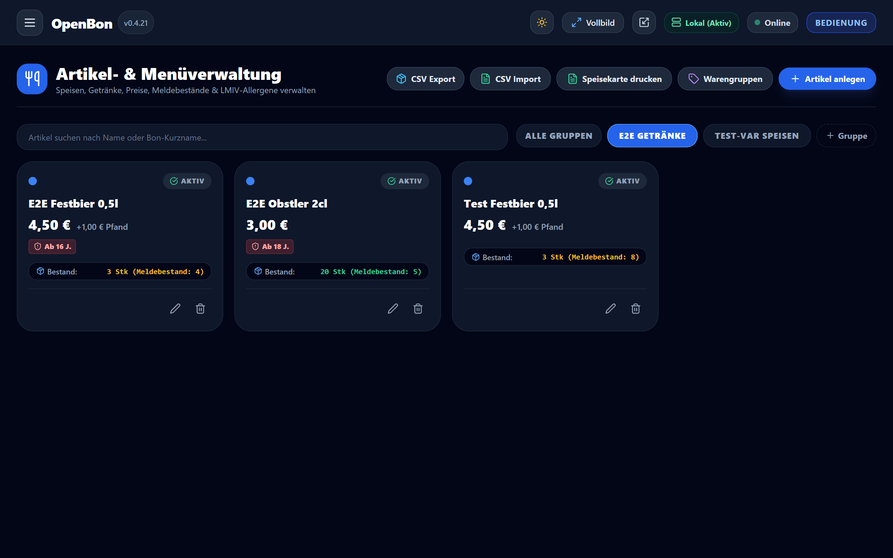
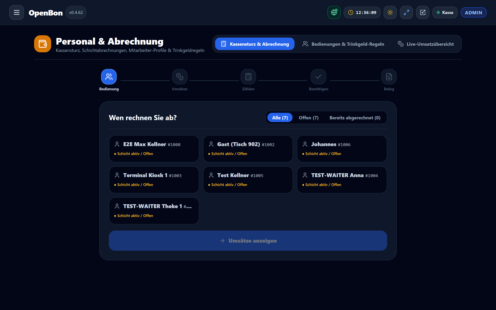

# OpenBon – Enterprise Kassen-, Bestell- & Festmanagementsystem

[](https://github.com/loe17/OpenBon/releases)
[](https://github.com/loe17/OpenBon)
[](LICENSE)
[](https://github.com/loe17/OpenBon)
[](https://github.com/loe17/OpenBon)

**OpenBon** ist ein modernes, plattformunabhängiges und offline-fähiges Open-Source Kassen- und Bestellsystem. Entwickelt für die hohen Anforderungen bei **Vereinsfesten, Feuerwehrfesten, Gastronomie, Foodtrucks und Großveranstaltungen** – mit höchster Ausfallsicherheit, sekundenschneller Touch-Bedienung und nativer Anbindung handelsüblicher Thermobondrucker (ESC/POS).

---

## 📸 Screenshots & Benutzeroberfläche

### 1. Stationsübersicht & Bonkasse / Thekenverkauf
| 🚀 Stationsauswahl & Schnellstart | 💳 Bonkasse / Theke (Schnellverkauf) |
| :---: | :---: |
|  |  |
| *Zentrale Kachelübersicht mit Direktzugriff auf Kassen, Funkbedienung & Küche.* | *Schnellverkauf mit Warengruppen, Schnellwahltasten & Direktkassieren.* |

---

### 2. Mobiles Kellnern, Tischplan & Kassiermodal
| 📱 Grafischer Tischplan (Service) | ✍️ Schnelle Bestellaufnahme am Handy | 💰 Mobil Kassieren & Tisch-Splitting |
| :---: | :---: | :---: |
|  |  |  |
| *Tischstatus, Belegung & Beträge in Echtzeit.* | *Sorten, Varianten & Sonderwünsche per Fingertipp.* | *Teilabrechnungen, Trinkgeldrechner & Bar/Karte.* |

---

### 3. Küchen- & Ausschankmonitor (KDS) & Digitaler Beleg
| 👨‍🍳 Küchen- & Ausschankmonitor (KDS) | 🧾 Digitaler E-Bon (§33 KassenSichV) |
| :---: | :---: |
|  |  |
| *Digitale Bons abhaken, Farbcodes nach Wartezeit & fixierte Filterleiste.* | *Rechtssicherer, papierloser Beleg am Gast-Smartphone via QR-Code & NFC.* |

---

### 4. Leitstand, Artikelverwaltung & Abrechnung
| 👑 Admin-Dashboard & Live-Leitstand | 🍕 Artikelverwaltung & PDF-Import | 💼 Personal & Schichtabrechnung |
| :---: | :---: | :---: |
|  |  |  |
| *Live-Umsatz, Kassen-Uhrzeit, 400ms CPU/RAM-Last & kompakte Leiste.* | *Artikel-Zeitfenster & Speisekarten-Import aus PDFs.* | *Geführter Kassensturz, Zählprotokoll & Kellnerabrechnung.* |

---

## 🚀 Schnellstart & Installation

### 1. Headless 1-Klick Komplettinstallation (Raspberry Pi & Linux)
```bash
curl -fsSL https://raw.githubusercontent.com/loe17/OpenBon/master/install-headless.sh | sudo bash
```
*Richtet automatisch Node.js, Avahi-mDNS (`http://openbon.local`), SQLite mit WAL, Litestream-Replikation und den systemd-Hintergrunddienst ein.*

---

### 2. Windows (1-Klick Start)
Doppelklick auf die Datei:
```cmd
start.bat
```

---

### 3. Manueller Entwicklungsstart
```bash
# 1. Abhängigkeiten installieren
npm install

# 2. Datenbank synchronisieren & seeden
npx prisma db push
node prisma/seed.js

# 3. Testsuite ausführen (58 Testsuiten, 397 Tests)
npm test

# 4. Server starten
node server.js
```

---

## 💻 Hardware-Empfehlungen & Kapazitätsplanung

OpenBon ist extrem ressourceneffizient und benötigt keinen teuren Server. Je nach Festgröße und Anzahl der Geräte gelten folgende Mindestempfehlungen für den Hauptrechner:

| Festgröße & Besucherzahl | Gleichzeitige Geräte | Rechner & Mindestanforderung Prozessor | Arbeitsspeicher & Festplatte |
| :--- | :--- | :--- | :--- |
| **Kleines Fest** (bis ca. 500 Gäste) | Bis zu 5 Geräte *(z. B. 2 Kellner, 1 Kasse, 1 Küchenanzeige)* | Kompakter Mini-PC oder einfacher Laptop. Mindestens **Intel Core i3 ab der 2. Generation** (z. B. i3-2350M), Intel Celeron N4100 / N5100, AMD Athlon 3000G oder Raspberry Pi 4. | Mind. 4 GB RAM, SSD-Festplatte (mind. 30 GB frei). |
| **Mittleres Vereinsfest** (500 bis 2.500 Gäste) | 6 bis 20 Geräte *(z. B. 8 Kellner, 2 Kassen, 2 Küchen- & Schankmonitore, 1 SB-Kiosk)* | Moderner Mini-PC oder Office-Laptop. Mindestens **Intel Prozessor N95 / N100**, **Intel Core i3 / i5 ab der 6. Generation** (z. B. i5-6400, i3-8100), AMD Ryzen ab 2000er-Serie oder Raspberry Pi 5. | Mind. 8 GB RAM, schnelle SSD-Festplatte (mind. 60 GB frei). |
| **Großes Festzelt** (über 2.500 Gäste) | 20 bis über 50 Geräte dauerhaft im Volleinsatz | Leistungsstarker Desktop-PC oder starker Mini-PC. Mindestens **Intel Core i5 oder i7 ab der 10. Generation** (z. B. i5-10400, i5-12400) oder AMD Ryzen 5 / 7 ab 4000/5000er-Serie. | Mind. 16 GB RAM, schnelle NVMe-SSD (mind. 120 GB frei). |

> **Praxistipp für den Festbetrieb:** Den zentralen Kassenrechner stets per **Netzwerkkabel (LAN)** direkt an den WLAN-Router anschließen, um Funkstörungen und Latenzen im Festzelt zu minimieren. Ein angeschlossener Laptop bietet dank Akku eine automatische Stromausfallsicherung (USV).

---

## 📱 Stationszugriff & URLs im lokalen Netzwerk

Jedes Endgerät im lokalen Netzwerk (WLAN) kann die Stationen direkt im Browser über `http://openbon.local` oder die IP-Adresse des Rechners aufrufen:

| Station | URL | Zweck & Zielgruppe |
| :--- | :--- | :--- |
| **🚀 Erststart-Assistent** | `http://openbon.local/setup` | Schnelleinrichtung bei Erstinbetriebnahme (PINs, Tische, Drucker). |
| **👑 Admin Dashboard** | `http://openbon.local/admin/dashboard` | Live-Umsatz, Kassenrechner-Uhrzeit, 400ms Systemmetriken & Leitstand. |
| **💳 Bonkasse / Theke** | `http://openbon.local/pos` | Schneller Thekenverkauf, Wertmarken, ZVT-Kartenzahlung & Barwechselgeld. |
| **📱 Kellner-Mobilteil** | `http://openbon.local/waiter` | Mobile Tischbestellung, Gänge, Funknotrufe & direktes Kassieren am Tisch. |
| **👨‍🍳 Küchenmonitor (KDS)** | `http://openbon.local/kitchen` | Digitale Küchenbons mit Farbcodes und vertikalem Scrollen. |
| **💼 Personal & Abrechnung** | `http://openbon.local/admin/settle` | Geführter Kassensturz, Kellner-PINs, Trinkgeld-Pools & Live-Umsätze. |
| **🖥️ SB-Kiosk Terminal** | `http://openbon.local/kiosk` | Eigenständiges Gäste-Bestellterminal für Selbstabholer. |
| **📲 QR-Tischbestellung** | `http://openbon.local/guest/table/1` | Kontaktlose Gastbestellung direkt vom Tisch per Smartphone. |
| **🧾 Digitaler E-Bon & NFC** | `http://openbon.local/receipt/[code]` | Papierloser Beleg gemäß §33 KassenSichV via QR-Code und Web NFC. |
| **💬 Team-Funk** | `http://openbon.local/chat` | Echtzeit-Chat für Service, Ausschank, Küche und Kassenleitung. |
| **📖 Handbuch & Offline-Hilfe** | `http://openbon.local/docs` | Vollständiges, integriertes Benutzerhandbuch für alle Stationen. |

---

## 🛡️ Enterprise-Sicherheit & Härtung

- **Vollständige Session-Schranke:** Alle internen API-Endpunkte (`/api/orders`, `/api/payments`, `/api/reports`, etc.) verlangen eine gültige signierte JWT-Session.
- **Kryptografisches PBKDF2-PIN-Hashing:** Stations- und Kellner-PINs werden mit 100.000 Runden, individuellem Salt und Constant-Time-Vergleich geprüft.
- **Zod-Typvalidierung:** Alle schreibenden APIs validieren eingehende Datenstrukturen streng gegen Schemata.
- **Socket.IO Handshake-Auth:** Socket-Rollen werden ausschließlich aus dem verifizierten Token abgeleitet (keine unautorisierte Rechteübernahme möglich).
- **Rollenbasierte Zugriffskontrolle (RBAC):** Zentral definierte Rechte für `ADMIN`, `POS_CASHIER`, `WAITER` und `KITCHEN`.
- **Geschützte Gastbestellung:** Tisch-`qrToken` zwingend erforderlich; Rate-Limiting gegen Denial-of-Service.

---

## ⚡ Ausfallsicherheit & Hochverfügbarkeit

```
[ Raspberry Pi 5 Kassen-Server ]
  ├── SQLite mit PRAGMA synchronous = FULL
  ├── Litestream Service ──► Kontinuierliche WAL-Replikation auf USB-Stick (RPO < 1s)
  │
  └── Offline-First Tablets (PWA)
        ├── Service Worker Cache: Menükatalog & Tischpläne offline verfügbar
        └── IndexedDB Outbox: Bestellungen & Zahlungen bei WLAN-Abbruch lokal gesichert
```

1. **Offline-First mit Client-Outbox:** Bricht das WLAN im Festzelt ab, speichern Kellner-Tablets und Thekenkassen die Vorgänge in der lokalen IndexedDB. Beim Reconnect synchronisiert die Outbox automatisch mit Idempotency-Keys (keine Doppelbons).
2. **Litestream WAL-Replikation:** Jede geschriebene Buchung wird im Sekundentakt auf einen USB-Stick oder ein Zweitgerät gespiegelt.
3. **Automatisches Drucker-Fallback-Routing:** Ist ein Bon-Drucker offline oder ohne Papier, leitet der Spooler den Auftrag automatisch auf den konfigurierten Ersatzdrucker um.
4. **Kalt-Standby & 1-Klick Disaster Recovery:** Bei Hardwareausfall des Servers wird das Ersatzgerät mit `./scripts/litestream-restore.sh` in 2 Minuten auf den exakten Stand wiederhergestellt.
5. **Automatischer Backup-Scheduler:** Erstellt zyklisch Online-Snapshots (`VACUUM INTO`) mit 10-fach Rotation.
6. **Persistente Druck-Warteschlange:** Druckaufträge überleben Server-Neustarts und werden bei Drucker-Störungen mit automatischem Retry verarbeitet.

---

## 👆 Durchgängige Touch-Bedienung & Praxis-Features

- **Große Touch-Ziele:** Sämtliche Schaltflächen und Schnellauswahlfelder besitzen eine Mindesthöhe von 48px (`min-h-[48px]`) mit haptischem Feedback und `touch-manipulation`.
- **4 Barrierefreie POS-Themes:** Umschaltbar zwischen *Dunkel (Modern Slate)*, *Hell (Klares Tageslicht)*, *Tradition & Verein (Warm Amber)* und *High-Speed Tresen (Kompakt)* – alle mit automatisierter mathematischer WCAG 2.1 Kontrastvalidierung.
- **Vollständiger Bargeld-Ziffernblock & Stückelung:** Einheitlicher Touch-Ziffernblock (`0–9`, `00`, `C`, `,`) plus Direkttasten für alle Euro-Scheine (5€ bis 200€) und Münzen (0,01€ bis 2€) mit automatischer Wechselgeld-Berechnung.
- **Live-Druckerwarteschlange (Spooler Manager):** Interaktive Überwachung aller offenen, gedruckten und fehlgeschlagenen Druckaufträge mit 1-Klick-Wiederholung (Retry), Drucker-Umleitung (Reroute) und Bon-Vorschau.
- **Artikel-Zeitfenster (zeitgesteuerte Sichtbarkeit):** Artikel können per Checkbox mit flexiblen Zeitfenstern (z. B. Mittagstisch 11:30–14:00 Uhr, Kuchenbuffet oder Barbetrieb) belegt werden. Außerhalb der Zeiten werden sie an Kasse und Kellnergeräten automatisch ausgeblendet.
- **Intelligenter PDF-Speisekarten-Import:** Speisekarten und Festflyer als PDF hochladen – Speisen, Getränke, Preise und Steuersätze werden automatisch erkannt und in einer bearbeitbaren Tabelle zur 1-Klick-Übernahme aufbereitet.
- **Sub-Sekunden-Systemmetriken (400 ms), ruckelfreie Uptime & kompakte Menüleiste:** CPU- und RAM-Last werden ca. 2,5 Mal pro Sekunde live erfasst (< 0,1 % Eigenlast) mit stufenlos-monotoner Server-Laufzeitanzeige. Eine permanente Kassen-Uhr und ein schlanker Internet-Globus in der oberen Admin-Leiste halten die Menüleiste auf jedem Endgerät aufgeräumt und kompakt.
- **Küchenmonitor mit vertikalem Scrollen & fixierter Leiste:** Flüssiges Scrollen auf Küchenmonitoren bei fixierter Filter-Kopfleiste.
- **Kellner-Zwischenstand (X-Bon) & Auto-Lock:** Schneller 1-Klick Schichteinblick (Bargeld-Soll im Geldbeutel, Umsatz, Trinkgeld) und Inaktivitäts-Schutz auf Smartphones.
- **Kontaktloser E-Bon per NFC & QR:** Direkte Belegübertragung via Web NFC an Gast-Smartphones oder per Cloudflare Tunnel / Netcup Webhosting über Mobilfunk (§33 KassenSichV).
- **Beleg-Auswahl an der Bonkasse:** Touch-Fenster nach dem Kassieren mit `E-Bon per NFC`, optionalem `Papierbon` und `Kein Beleg` für maximalen Durchsatz an der Theke.
- **Konfigurierbarer Papierbon-Knopf an der Bonkasse:** Schnellwahlschalter in Kopfzeile und Warenkorb sowie Nachdruckfunktion (`Erneut drucken`) bei Kundenwunsch oder Papierstau.
- **Schutz vor Datenverlust bei ungespeicherten Einstellungen:** Lückenloser In-App-Navigationsschutz beim Verlassen editierter Admin-Einstellungen.
- **Keine blockierenden Browser-Popups:** Alle Bestätigungen und Warnungen erfolgen über animierte Toasts und barrierefreie Touch-Dialoge.
- **Personal & Abrechnung (`/admin/settle`):** Vereinte Zentrale mit 3 Reitern für geführten Kassensturz (inkl. Ist-Trinkgeld-Zählung und Soll/Ist-Vergleich), Kellner-PINs & Trinkgeld-Verteilungsregeln sowie Live-Umsatzübersicht aller Bedienungen.
- **Trinkgeld-Schnellrundung per Pfeiltasten:** Am Kellner-Terminal runden 4 Pfeile (▲/▼ für 1,00 € und 0,50 €) Beträge sekundenschnell auf; Trinkgeld wird automatisch errechnet und verbucht.
- **Tisch-Bestellhistorie:** 1-Klick-Einsicht aller bisherigen Bestellungen an einem Tisch über alle Kellner hinweg.
- **System-Update & Diagnose (`/admin/system-update`):** RAM- und CPU-Auslastung im 400ms-Takt, Schalter "Nur Releases anzeigen" und 1-Klick Hotfix-Aktualisierung.
- **1-Klick Vorlagen-Download & Upload (EventProfiles):** Fest-Vorlagen als handliche JSON-Datei sichern, teilen und auf beliebigen Kassen wieder hochladen.

---

## 📚 Dokumentation & Leitfäden

Im Verzeichnis [`docs/`](docs/) sowie direkt in der Kasse unter `/docs` stehen praxisnahe Anleitungen bereit:

- 📖 **[`docs/ANLEITUNG.md`](docs/ANLEITUNG.md)**: Vollständige Bedienungsanleitung für alle Stationen und Einstellungen.
- 💻 **[`docs/HARDWARE_EMPFEHLUNGEN.md`](docs/HARDWARE_EMPFEHLUNGEN.md)**: Detaillierte Hardware-Empfehlungen und Kapazitätsplanung nach Festgröße.
- 🖨️ **[`docs/DRUCKER_SETUP.md`](docs/DRUCKER_SETUP.md)**: Netzwerk-Bondrucker (ESC/POS) einrichten und Fehler beheben.
- 💳 **[`docs/KARTENZAHLUNG_ANLEITUNG.md`](docs/KARTENZAHLUNG_ANLEITUNG.md)**: Einrichtung von ZVT-Terminals, SumUp, Sparkasse S-POS & VR Pay:Me SoftPOS.
- 🌐 **[`docs/EBON_ONLINE_ANLEITUNG.md`](docs/EBON_ONLINE_ANLEITUNG.md)**: E-Bon Online-Bereitstellung (Cloudflare Tunnel, Netcup DynDNS) & NFC-Übertragung.
- 💾 **[`docs/AUSFALLSICHERHEIT_LITESTREAM.md`](docs/AUSFALLSICHERHEIT_LITESTREAM.md)**: Litestream-Setup, USB-Replikation und Kalt-Standby.
- 📱 **[`docs/OFFLINE_FIRST_GUIDE.md`](docs/OFFLINE_FIRST_GUIDE.md)**: Offline-First Leitfaden für Kassenbedienungen und Helfer.
- 🆘 **[`docs/NOTFALL_RUNBOOK.md`](docs/NOTFALL_RUNBOOK.md)**: Stufenplan & Papier-Notbetrieb bei Stromausfall.
- 🔒 **[`docs/ONLINE_BETRIEB.md`](docs/ONLINE_BETRIEB.md)**: Sicherheits-Leitfaden für den gesicherten Internet-Betrieb.

---

## 🧪 Tests & Qualitätssicherung

```bash
# Gesamte Testsuite ausführen (TypeScript-Prüfung & Vitest)
npm test

# Produktions-Build kompilieren
npm run build
```

- **58 Test-Suiten / 397 Tests (100% bestanden):** Umfassende Testabdeckung für den gesamten Kassen-Lebenszyklus, Rechner-Metriken, Tisch-Splitting, E-Bon, Druckerspooler, Bonverbrauchsrechner, geräuschlosen Stopp-Bon, Web-Relay, Tischplan-Randleisten, Fiskalisierung, Artikel-Zeitfenster, PDF-Speisekarten-Import, Kassen-Uhrzeit, kompakte Menüleiste, Setup-Wizard und WCAG-Kontrast.

---

## 📄 Lizenz

Dieses Projekt steht unter der [MIT License](LICENSE) – frei nutzbar für Vereine, Hilfsorganisationen, Gastronomie und private Veranstaltungen.
