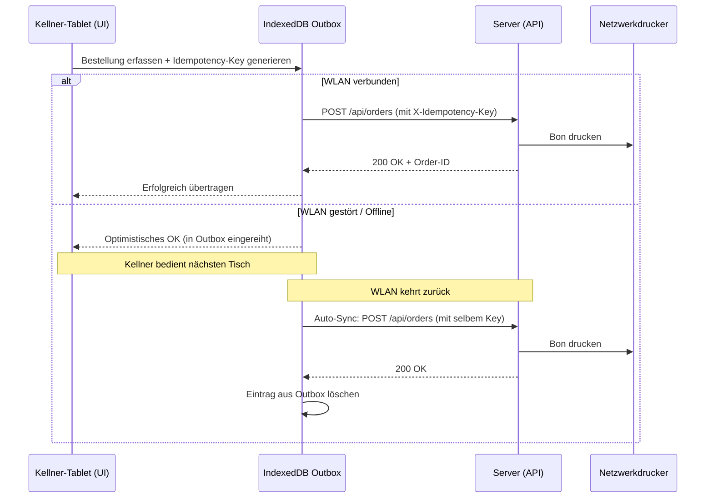

# Offline-First & Client-Outbox Leitfaden

Dieser Leitfaden beschreibt das **Offline-First-Konzept** von OpenBon für mobile Bedienungs-Tablets und Thekenkassen bei instabilem oder ausfallendem WLAN.

---

## 📱 Wie funktioniert Offline-First in OpenBon?

1. **Service Worker & PWA Caching (`sw.js`)**:
   - Die gesamte Kassen-Applikation, Speisekarte, Artikelkatalog und Tischpläne werden im Browser des Tablets zwischengespeichert.
   - Wenn das WLAN abbricht, zeigt das Tablet keine weiße Fehlerseite, sondern arbeitet nahtlos weiter.

2. **Lokale Outbox (IndexedDB)**:
   - Jede Bestellung und jede Zahlung erhält einen eindeutigen `idempotencyKey`.
   - Bei fehlender Netzwerkverbindung wandert der Vorgang in die lokale IndexedDB-Warteschlange.
   - Der Kellner erhält die Bestätigung: *„Offline gesichert – wird automatisch übertragen, sobald WLAN verfügbar ist."*

3. **Automatischer Reconnect & Synchronisation**:
   - Sobald das Gerät wieder Empfang hat (`window.addEventListener('online')`), sendet die Outbox alle wartenden Vorgänge in der exakten Reihenfolge an den Server.
   - Durch serverseitige Idempotenz entstehen **niemals doppelte Buchungen oder Bons**.

---

## 📋 Verhalten für Helfer & Bedienungen

### Was tun, wenn das WLAN im Zelt abreißt?
- **Einfach normal weiterkassieren und bestellen!**
- Die Tablets speichern die Bons lokal.
- Sobald man sich wieder in Reichweite des Access Points bewegt, leert sich die Warteschlange von alleine.
- An der Bonkasse und am Küchendrucker werden die Bons in der richtigen Reihenfolge ausgegeben.

---

## 🔍 Technischer Ablauf

